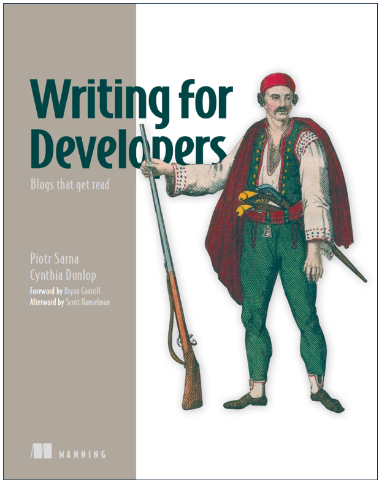

# Writing For Developers: Blogs That Get Read

**Update:** All the formats are now available in all the places. Some direct links: [Manning](https://www.manning.com/books/writing-for-developers?utm_source=dunlop&utm_medium=affiliate&utm_campaign=book_dunlop_writing_5_16_24&a_aid=dunlop&a_bid=33a8dae6&chan=mm_twitter&) | [Amazon US](https://www.amazon.com/Writing-Developers-Blogs-that-read/dp/1633436284) | [India](https://www.amazon.in/Writing-Developers-Blogs-that-read/dp/1633436284/ref=tmm_pap_swatch_0?_encoding=UTF8&dib_tag=se&dib=eyJ2IjoiMSJ9.QLjCrRZLwxQfC5D3ku3TRA.bZFwFfuPsANbFBK_0WaZXPc41PvkTMLa8GOQKiUmnjs&qid=1738000296&sr=8-1) | [UK](https://www.amazon.co.uk/Writing-Developers-Blogs-that-read-ebook/dp/B0DSWM75J1/ref=tmm_kin_swatch_0?_encoding=UTF8&dib_tag=se&dib=eyJ2IjoiMSJ9.esl_7-Wikbyj4Sm3TVytK9aqGoZ44XQnITlniEGfYDCRK4Ai9yZv1ybVQpvLuZvy-nvMjbsJJNqMTXl6lQ_HXz4wNT98KzUphta_qEdsnZp2IHAjuCtT8UqGX0Q1I5Ce3e4d12KpL-VLe4gvaGwOWsMIBIT1r0fmEaDURFGSKV_aH1FVt-J3o8q2lvwd8mN1WQDbg4amoR9w0eFR0iBzbLpR76-U2i3_X30-D1pzkCI.6t-j0TJrJqYMPbY3h_sS8EDDJ_gcL6u0zPlD0XdjSSw&qid=1738000537&sr=8-1) | [DE](https://www.amazon.de/-/en/Writing-Developers-Piotr-Sarna/dp/1633436284/ref=tmm_pap_swatch_0?_encoding=UTF8&dib_tag=se&dib=eyJ2IjoiMSJ9.pNjtM75h8hGEebJe8QDv2BnDgvh2wd6dpsJ0FYYngIpk_g5FW8LqH9R_azLwXGyZrFuXkSpFe_InPYU_XW8Q9hENCwb-Ek8cWwnAc1jCAR5O9P1vjcdg9-FpHWn7GUM5w-U_B_qYy_6X1AbIMUHaHV4NTvz9DpDGawyiqVEhStSVN_-bM4qurrJgTMKROm8ZreLOQ3xr5b529XUkJWcXCTR5PeZoMestq8eN4ErLptk.fvoEzL1dOeDlgnUlLA1hYh38mKL9qamQ4CVGzWJRQ7s&qid=1738000474&sr=8-1) | [Japan](https://www.amazon.co.jp/-/en/Piotr-Sarna-ebook/dp/B0DSWLC5BN/ref=sr_1_2?crid=2OOI1DDWXY9FC&dib=eyJ2IjoiMSJ9.3Bv1Zy50M3shE_HSxUjRFFcdPIT9LL73_tKYdjqIotd8cxVY9BWkyNcxQuwgwCw7F2YLKJj1DCe9dPDFLx8K4A.Tst9Jc0rY2V-HVYxLRteKuFFvECuw3xWBmIrg_5NL2A&dib_tag=se&keywords=writing+for+developers&qid=1738000735&sprefix=writing+for+developers%2Caps%2C86&sr=8-2). Also, we started [writethat.blog](https://writethat.blog/) and [a related "newsletter"](https://writethatblog.substack.com/) for people who want to read/write great engineering blog posts. We're currently featuring writing tips from expert bloggers like Jeff Atwood, Charity Majors, antirez, Bryan Cantrill, and more. 

If you ended up here via a podcast, here are the discount codes for Manning purchases:
 - Oxide and Friends: OXIDE50
 - Hanselminutes: HMdunlop
 - GOTO: GOTOdunlop
***
*Writing For Developers: Blogs That Get Read* is a practical guide to writing more compelling engineering blog posts. 

We discuss strategies for nailing all phases of the technical blogging process. And we have quite a bit of fun exploring popular engineering blog post patterns such as “The Bug Hunt,” “How We Built It,” “Lessons Learned,” “We Rewrote It in X,” “Thoughts on Trends,” etc. Each "pattern" chapter includes an analysis of real-world examples as well as specific dos/don’ts for that particular pattern. There's a section on moving from blogging into opportunities such as article writing, conference speaking, and book writing. Finally, we wrap with a critical (and often amusing) look at generative AI blogging uses and abuses.

Oh...and there's also a **foreword by Bryan Cantrill** and an **afterword by Scott Hanselman**!  

You can [preview the chapters on the Manning site](https://livebook.manning.com/book/writing-for-developers).

## Recommendations
"In my experience, only a small fraction of developers write long-form (blogs, essays, reflections). Those who do tend to see benefits both over the short and long-run. This book is a missing guide to provide inspiration to get started writing down your thoughts. Getting started is always the most difficult step!" **\- Gergely Orosz, author of The Pragmatic Engineer Newsletter and The Software Engineer's Guidebook**

“A great blog can help put your career onto the fast track, and this is the book telling you how. A must-read!” **\- Gunnar Morling, Software Engineer at Decodable**

“There is no better way for an engineer to supercharge their growth, develop their career, and make a lasting mark on the world than by writing about their work, yet a very small fraction of us ever do so. This book is full of simple, practical guidance for improving your craft and increasing your impact on the industry. I will be recommending it far and wide.”  **\- Charity Majors, Co-founder and CTO at Honeycomb**

“Writing is a way to garbage collect your thoughts into a clear narrative, not just for the audience but for the individual.  Most content is noise and boring, and learning to distill the important makes you a clear thinker. It is a grueling process - for me - moving from frustration to eureka, especially if your wife is a literature major. *Writing for Developers* is a down-to-earth manuscript with a punk rock DIY attitude that demystifies the process and helps authors move past the writer’s block that we all face. A fun read to make you a better writer.” **\- Alex Gallego, Founder and CEO of Redpanda** 

"Afraid of writing blog posts? Afraid of your boss who wants you to write blog posts? This comprehensive guide to writing engineer-oriented blog posts is for you!" **\- Avi Kivity, CTO and Co-founder of ScyllaDB**  

"This book packs years of experience into a convenient guide targeted to software engineers. It'll help you write more effectively so you can write better blogs in less time. **\- Pekka Enberg, CTO and Co-founder of Turso**

“For dev-focused startups, blogging is do-or-die. This book offers lots of actionable tips, even for those of us who have been writing for years. Plus, it’s a seriously fun read.” **\- Glauber Costa, CEO and Co-founder of Turso**

“Piotr and Cynthia give not merely guidance on how to write, but suggestions of what to write – of unearthing the narrative arcs that naturally occur within the work of software practitioners. The book is loaded with specific examples of writing in the wild that can serve as object lessons.” **\- Bryan Cantrill, Co-founder and CTO of Oxide Computer** 

"It's rare that I get a tech book and immediately think, "Oh, this will be useful for years to come!" But that is exactly how I feel about Piotr Sarna and Cynthia Dunlop's new book, *Writing for Developers.* Highly recommend."
**\- Matt Butcher, CEO at Fermyon Technologies** 

"Piotr and Cynthia have both been tremendously helpful to me with writing and communicating effectively, and it's so exciting to see their wisdom distilled and shared with the world. If you're writing for developers, the best decision you can make is to read *Writing for Developers*." **\- Bo Ingram, Author of ScyllaDB in Action**  

"If you're reading this book, you're already one step ahead, because you understand the best programming language we've ever created is the one you've known since you were four years old." **\- Jeff Atwood, Coding Horror Owner/Writer, Co-founder of Stack Overflow** 

"Writing is a key skill for developers, and blogging is a fun way to improve this skill while sharing your ideas with a wider audience and advancing your career. I wish more developers blogged. If you are even thinking about blogging, *Writing for Developers*, is a must-read. It is basically “design patterns” for blogs, with a lot of references and ideas. I really like the short-snippet structure, since you can get a lot out of the book without committing to weeks of head-down reading. I really hope this book will inspire more of you to blog." **\- Gwen Shapira, Founder of SaaS Developer Community and Nile Database**

## Write That Blog!
As a not-so-subtle hint to our readers, we created https://writethat.blog. We’ll be continuously updating this site with interesting engineering blog posts, including Piotr’s pundit commentary. 

Bonus: See how Piotr [built "Write That Blog!" with Turso](https://turso.tech/blog/write-that-blog-with-turso)

If you want monthly Write That Blog! updates via email, [here you go](https://writethatblog.substack.com/)! We'll also use that Substack to share [insights from top tech bloggers](https://writethatblog.substack.com/t/tech-blogger-insights) and new articles on topics from the book.

## About This Repo 
This repository aggregates links to all the blog posts and other references we mention in the book. And as we create or encounter related writing resources, we'll add them here too. 
- [Links](/links/README.md)
- [Book excerpts](excerpts/README.md)
- [Errata](/errata/README.md)

## Feedback
Want to share your thoughts on the book? Report errata? Something else? Connect on LinkedIn ([Piotr Sarna](https://www.linkedin.com/in/sarna-dev) | [Cynthia Dunlop](https://www.linkedin.com/in/cynthiadunlop/)), X ([@sarna_dev](https://x.com/sarna_dev) | [@c_a_dunlop](https://x.com/c_a_dunlop)), or Bluesky [@sarna.dev](https://bsky.app/profile/sarna.dev) | [@cynthiadunlop.bsky.social](https://bsky.app/profile/cynthiadunlop.bsky.social).

