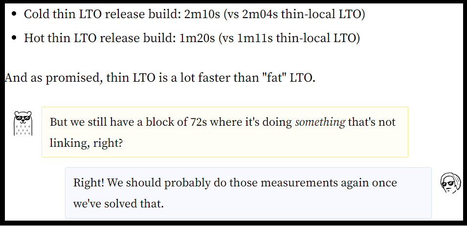

# The “Bug Hunt” Blog Post Pattern

*The following text is an excerpt from Chapter 8*

Just like different programming languages have different conventions, so do different types of blog posts. A captivating bug hunt article will vary dramatically from an opinion piece roasting a highly hyped technology…or an article that shares how a team implemented an industry-changing algorithm. Part 3 of this book involves in-depth analysis of these and other blog post “patterns” – exploring real-world examples, characteristics, and dos/don’ts for each. 

The “Bug Hunt” blog post pattern is the programming world’s equivalent of a detective story. It has a theme, a main plot, side plots, a protagonist (you), an antagonist (usually also you, having introduced the bug two weeks ago in the first place). It's captivating, keeps readers in suspense, and ends with a satisfying plot twist, or a tactical cliffhanger. And the best part is…it's even more fun to write than to read!

## Purpose
Writing a bug hunting article serves a few purposes, depending on the success of the hunt, where the fault ultimately fell, and a few other factors. Let's tackle the potential purposes one by one.
Knowledge dump

The fact that a bug appeared and was fixed is undeniably important. But what's way more important is reducing the chance that it happens again – and knowing what to do if it does. While hunting for a bug, it's likely you encountered the following:

 - A few dead ends
 - A very convincing red herring
 - A tool that looked helpful at first, but ended up being unrelated
 - Another tool that proved immensely useful
 - Some blog post from 2014 that led you to discover the root cause

All those steps are incredibly useful for the future debugger of another similar issue (likely you again, two weeks older). Awareness of the past dead ends and distractions is especially helpful here. Quick identification of a known red herring can save the future debugger (you) a few hours of unproductive research. You can treat bug hunting blog posts as scrolls of ancient knowledge (two weeks or older), created by your predecessors (you) to pass it on to future generations (also you).

### Global bug awareness
It's give-back-to-the-community time! Chances are, the bug that you fixed doesn't uniquely apply to your project. Instead, it was caused by a sneaky pitfall in your language of choice, one of the libraries, or specific hardware. Your article can genuinely inspire others to think "Huh, we do have exactly the same setup – makes me wonder…" It might also motivate the team behind that technology to consider ways to stop others from making the same mistake.

As a result, writing a story about how you fixed an interesting bug may cause a few other bugs of the same category to be fixed worldwide. It's a superpower! This purpose is especially important if the bug is related to:
 - Bleeding edge software
 - Novel hardware
 - A young open-source community

Those tend to develop dynamically and have very little test coverage compared to industry standards simply because they are too young to be implemented in a critical mass of projects. You can think of this purpose as an external version of the previously described "knowledge dump" – it’s a knowledge dump that you write for everyone, not just for yourself or your team.

### Bragging
Set aside the negative connotation of the “bragging” word. Tech world bragging – at the right dosage – is good for you and your peers. Bragging about doing something interesting, like hunting and resolving a bug, helps you as well as your readers:
 - It's educational. Your audience can presumably learn something by reading how you achieved your goal.
 - It broadens your professional network. People intrigued by similar technologies and challenges will likely reach out to you as we outlined in Chapter 1.
 - It feels good. There’s no shame in acknowledging that attention is one of the benefits of telling the world that you did something.
 - It yields free criticism – hopefully constructive criticism, but valuable either way. The (often illusory) sense of anonymity on the Internet makes it easy to criticize others, so you can count on lots of comments and nitpicks after your article goes public. But after filtering out the vitriol, you can often learn something new, or even revisit your whole approach to the problem.

## Examples
Since bugs can occur anywhere, so can bug hunting blog posts. In the wild, you can find bug hunting posts published across a variety of blogs: Big Tech, unicorn, startup, and personal blogs. In general, bug hunting posts published by large high-profile companies are unsurprisingly less common (and more guarded) than those by startups as well as individual contributors writing about open-source contributions and weekend projects. 

Here are some prime examples of blog posts that apply the “Bug Hunt” pattern, along with Piotr’s commentary on each. 

### Hunting a NUMA Performance Bug
**Author:** Michał Chojnowski
**Source:** ScyllaDB Blog (https://www.scylladb.com/2021/09/28/hunting-a-numa-performance-bug/)

#### Summary
The article describes a performance regression happening on modern hardware with NUMA (Non-Uniform Memory Access) design. The regression seemed to occur randomly on half of the runs, which made it much harder to pinpoint. The article shares a few failed (but nonetheless skillful and impressive) attempts to diagnose the problem. Then, one of the observations leads straight to a breakthrough and a surprisingly small fix – measured with lines of code.
#### Commentary
This is the pinnacle of bug hunting blog posts. It’s deeply technical, but at the same time simple to follow. The less experienced readers can skip some of the nitty-gritty details and still learn a lot. All of the failed attempts to diagnose the issue are educational, and surely usable in future debugging. 

The casual expertise that the author shows while editing executable binaries directly as if they were text files makes the blog post an extremely enjoyable read. The solution to the problem is also very satisfactory, especially to a programmer’s mind: just one seemingly innocent line of code changed, and all the performance regressions are eliminated.

### Why Is My Rust Build So Slow?
**Author:** Amos Wenger
**Source:** fasterthanlime Blog (https://fasterthanli.me/articles/why-is-my-rust-build-so-slow)
#### Summary
This extensive blog post investigates compilation time issues for a Rust project. It shows multiple techniques for how to profile the compiler itself, decompose the compilation process into manageable pieces, and measure how long each piece takes and why. It's full of images, code snippets, and descriptions of concrete tools you can use. The article's conclusion is not really any single breakthrough, but rather honest advice to apply all the extensive techniques above if you're unsatisfied with your Rust build times.

#### Commentary
Compared to an average technical blog post, this one is a hog – in a purely positive sense! It can easily take a skilled reader half an hour to read through it, and it's probably a good idea to digest it in three or four parts, taking breaks from the screen to avoid dizziness and diplopia. 

This is a positive trait because it makes the article stand out. Many tech articles try to squeeze as much information as possible into 4 to 6 minutes of reading. And that’s fair, considering the average attention span of a human being raised on smartphones rather than playing outside all day with occasional cartoon breaks. Yet, a long article will appeal to the old school folks who were once capable of reading a book in a single sitting. 

The article has a unique style featuring the author's alter ego, Cool Bear, who regularly adds short humorous comments – keeping the reader engaged throughout the (lengthy) reading process. 

*This article highlights insights from the author’s alter ego, Cool Bear – sometimes in dialog with the author’s own interior monologue.*

This type of a bug hunting blog post also serves as an encyclopedia of techniques for debugging the Rust compiler. I have it bookmarked, just in case I ever need to refresh my knowledge of how to measure linking times in my projects. The conclusion is also quite unconventional: instead of building tension and finally presenting readers with a surprise solution, it's simply an honest summary with encouragement to reach out.

### How a Single Line of Code Made a 24-core Server Slower Than a Laptop
**Author:** Piotr Kołaczkowski
**Source:** Piotr Kołaczkowski’s Blog (https://pkolaczk.github.io/server-slower-than-a-laptop/)
#### Summary
The blog post describes how local benchmarks detected a bottleneck on machines with lots of CPU cores. The author shares a performance analysis, performs some profiling, then offers a few explanations of how modern CPUs work under the hood and how the processor caches manage memory. The suggested fix is a natural consequence of the conclusions reached earlier in the article: minimizing the amount of state shared between processor units eliminates the bottleneck.

#### Commentary
This is another stellar example of a bug hunting blog post. Its title is a little clickbaity, but still elegant enough to avoid being rejected by the average ad-blocking software. The technical details are much more universally understood than the ones in Chojnowski’s NUMA blog post (described earlier in this section). 

The article is sneakily educational, digressing on things like "How many nanoseconds does L3 cache access take on average on Intel Xeon." That's great practice; it leaves those details imprinted in readers' minds without them realizing it. Who knows – maybe one day that tucked-away tip might help fix a performance bug in another project. Overall, the article leaves readers satisfied with the result, and also a tiny bit smarter in the field of CPU architecture and performance.

### Lessons from Debugging a Tricky Direct Memory Leak
**Author:** Sanchay Javeria
**Source:** Pinterest Engineering Blog (https://medium.com/pinterest-engineering/lessons-from-debugging-a-tricky-direct-memory-leak-f638c722d9f2)
#### Summary
Pinterest's development team shares their experience hunting a stream processing code memory leak that led to cascading failures in their distributed system. It goes over debugging techniques for the Java environment and then finally pinpoints a bug in application code that caused the memory leak.
#### Commentary
This is a classic bug hunting article – so much so that it could be used as a blog post template for hunting down almost any issue in Java code. It contains the customary investigation steps, along with screenshots from observability tools. Also following custom, the culmination paragraph is called "The Fix." It explains that the culprit was yet another memory leak issue caused indirectly by garbage collection mechanisms in Java. Hint: It always is! 

In this context, the conclusion isn't really an earth-shattering breakthrough, but it definitely meets the readers' expectations. I bet the majority of the readers think "Ah, I knew it from the start" right after learning the root cause.

### ZFS Is Mysteriously Eating My CPU
**Author:** Brendan Gregg
**Source:** Brendan Gregg’s Blog (https://www.brendangregg.com/blog/2021-09-06/zfs-is-mysteriously-eating-my-cpu.html)
#### Summary
The blog post describes a hunt for the cause of mysterious higher-than-expected CPU usage. It shows how to narrow the candidates down to a single function call with analysis tools and concludes with a surprising performance bug in ZFS – a file system implementation. 
#### Commentary
The title itself is captivating, but then something in the URL jumps out at you: it's by Brendan Gregg, the flame graph inventor! This is a prime example of why personal brand matters so much. When I see “Brendan Gregg,” I immediately assume that the article is interesting … and I wasn't mistaken in the slightest. 

Given Gregg’s expertise, the problem analysis naturally involved flame graphs. The root cause is quite a surprise, and Gregg described it in a very informal and funny manner. The blog post is also very concise: a three-minute read, even if you reserve some time upfront to look at the flame graph screenshots. It clearly shows that you don't need to write thousands of words to squeeze in lots of knowledge, tips, and interesting technical details. 
...
